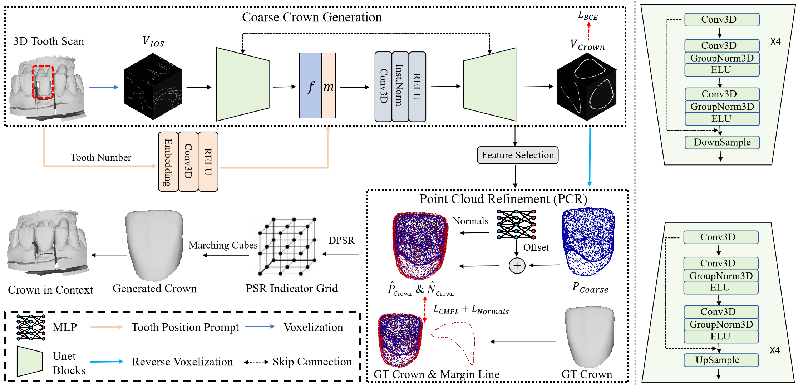

# Official Repo For MICCAI 2025 Paper--VBCD：A Voxel Based Framework for Personlized Dental Crown Generation

## Setup
```
pip install -r requirement.txt
```
## Model
The crownmvm2.py is the VBCD pipeline that can generate teeth
## Sample Data
We offered sample data for visualization. The antagonist tooth and the adjacent tooth are concated in a whole ply file.
## Contact Information
If you have questions on how to run the model, please contact: mcncaa219040@gmail.com， Wechat:1052366032
## Cite
```
@article{wei2025vbcd,
  title={VBCD: A Voxel-Based Framework for Personalized Dental Crown Design},
  author={Wei, Linda and Liu, Chang and Zhang, Wenran and Zhang, Zengji and Zhang, Shaoting and Li, Hongsheng},
  journal={arXiv preprint arXiv:2507.17205},
  year={2025}
}
```

